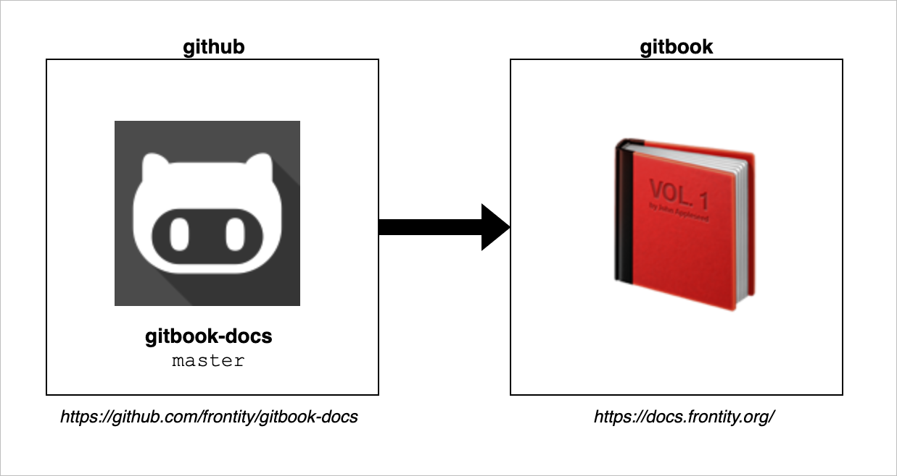

# Contributing to the Frontity Documentation

Any member of the community is welcome to suggest changes to Frontity's official documentation at any time.
Frontity's documentation can be found at https://docs.frontity.org/.
Any and all help is very much appreciated!

The following describes how to contribute to the Frontity documentation.

If you're stuck at any point, **don't hesitate to use our [Community Forum](https://community.frontity.org/c/docs-and-tutorials)** to ask for help or make your suggestions.

## What Does this Document Contain?

This document contains all the required information and links to resources needed to contribute to the Frontity documentation:

- [Code of Conduct](#code-of-conduct) - our Code of Conduct
- [Platform](#platform) - how do we get the online documentation site from these repository docs
- [Documentation Format](#documentation-format) - syntax of the documentation docs in this repository
- [Reporting Issues](#reporting-issues) - guidance on how to report an issue or provide feedback on the Frontity documentation
- [Contributions Workfows](#contributions-workfows) - a collection of workflows available for contributing
  - [Edit on GitHub](#edit-on-github) - the recommended way to suggest small changes
  - [Fork & Edit on GitHub](#fork-&-edit-on-github) - the recommended way to suggest several changes (in several files)
  - [Fork, Local Edit & Push](#Fork-&-Local-Edit-&-Push) - the recommended way if you're already familiar with git

## Code of Conduct

We provide a [**Code of Conduct**](https://github.com/frontity/docs/tree/master/CODE_OF_CONDUCT.md) to make clear the behavior we expect from contributors and maintainers alike.
We are committed to providing a welcoming and supportive environment and kindly request that you participate in these values also.

Our Code of Conduct is adapted from the [Contributor Covenant](http://contributor-covenant.org), version 1.4,
available at [http://contributor-covenant.org/version/1/4](http://contributor-covenant.org/version/1/4/).

## Platform

We use [gitbook](https://www.gitbook.com/) to generate the [documentation site](https://docs.frontity.org/) which is connected to our [`gitbook-docs`](https://github.com/frontity/docs/) repository (every time the `master` branch is updated the whole [documentation site](https://docs.frontity.org/) is rebuilt).

This `gitbook-docs` repository is the "source of truth" for Frontity's documentation and any suggested changes are managed through [Pull Requests](https://help.github.com/en/github/collaborating-with-issues-and-pull-requests/about-pull-requests) (to its [`master`](https://github.com/frontity/docs/tree/master) branch).

 
## Documentation Format

The documents in the `gitbook-docs` repository use [**Markdown syntax**](https://docs.gitbook.com/editing-content/markdown) to add format and structure to the texts.

> If you want to know more about Markdown then take a look at:
> - https://commonmark.org/help/
> - https://daringfireball.net/projects/markdown/syntax
> - https://markdown-guide.readthedocs.io/en/latest/basics.html

These Markdown documents are [used by gitbook](#platform) to generate the final HTML you can see in our [documentation site](https://docs.frontity.org/).

## Reporting Issues

If you have found a bug or a spelling mistake, or if you consider that information is missing or that improvements can be made, or if you find anything related to the Frontity documentation that you feel is an issue that should be reported, you can:

- Directly create a Pull Request with your suggested changes using one of the [Contributions Worflows](#contributions-workfows) as explained below
- Use our [Community Forum](https://community.frontity.org/c/docs-and-tutorials) to tell us about it

Our staff will review your suggestions and will take any actions necessary to improve our documentation taking your feedback into consideration.

## Code Releases

Want to do a [code contribution](https://docs.frontity.org/contributing/code-contribution-guide) that may require an update of the docs? 
Follow our [code releases](https://github.com/frontity/docs/wiki/Code-Releases) workflow

## Contributions Workflows

To suggest changes in Frontity's documentation **you'll need a GitHub account** (so create it if you don't have already one)

There are several workflows you can use to suggest changes.
All of them finish with the creation of a Pull Request.

> If you want to know more about Pull Requests you can take a look at:
> - [📑 "Opening a pull request" | opensource.guide ](https://opensource.guide/how-to-contribute/#opening-a-pull-request)
> - [📺 How to Contribute to an Open Source Project on GitHub | egghead.io ](https://egghead.io/courses/how-to-contribute-to-an-open-source-project-on-github)

Your changes will not be visible right away, the *Frontity Team* will first review them and then merge them if the suggested changes are approved.
So you don't need to worry about breaking anything!

Here you have the most important workflows you can use to suggest changes in our documentation:

#### • [`Edit on Github`](https://github.com/frontity/docs/wiki/Edit-on-Github)  📝 <a name="Edit-on-Github" />

This workflow is recommended for minor changes in just one file and for those who have little or no experience with git or github.
With this workflow you can edit documentation directly online in your browser.

Learn more about this workflow [here](https://github.com/frontity/docs/wiki/Edit-on-Github).

#### • [`Fork & Edit on Github`](https://github.com/frontity/docs/wiki/Fork-&-Edit-on-Github) 📝📝 <a name="Fork-&-Edit-on-Github" />

This workflow is recommended for changes in several files and for those who have some experience with git or github
With this workflow you can also edit documentation directly online in your browser.

Learn more about this workflow [here](https://github.com/frontity/docs/wiki/Fork-&-Edit-on-Github).

#### • [`Fork, Local Edit & Push`](https://github.com/frontity/docs/wiki/Fork-&-Local-Edit-&-Push)  📝📝📝 <a name="Fork-&-Local-Edit-&-Push" />

If you are familiar with Git, you can use the `Fork, Local Edit & Push` workflow.
This, in fact, is the preferred method for all but very minor changes.
If you've previously contributed to other projects on GitHub via pull requests, you should already be familiar with this workflow.

Learn more about this workflow [here](https://github.com/frontity/docs/wiki/Fork-&-Local-Edit-&-Push).

> For minor changes, or if you're new to GitHub, we suggest that you use the `Edit on Github` workflow, because it's a quick and easy way to make changes. 

> If you have knowledge of Git and/or your proposed changes are more extensive then we recommend that you use `Fork, Local Edit & Push`.
