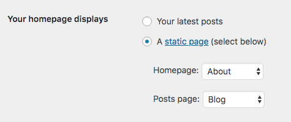

# @frontity/wp-source

## Installation

Add the `wp-source` package to your project:

```text
npm i @frontity/wp-source
```

And include it in your `frontity.settings.js` file:

```javascript
module.exports = {
  packages: [
    "@frontity/mars-theme",
    "@frontity/tiny-router",
    {
      name: "@frontity/wp-source",
      state: {
        source: {
          api: "https://site.com/wp-json"
        }
      }  
    }
  ]
}
```

## Settings

These are the settings you can change in your `frontity.settings.js` file:

#### state.source.api \(required\)

The url of your API. It can be from a self-hosted WordPress, like `https://site.com/wp-json` or from a WordPress.com site, like`https://public-api.wordpress.com/wp/v2/sites/site.wordpress.com`\(see [WordPress REST API on WordPress.com](https://developer.wordpress.com/2016/11/11/wordpress-rest-api-on-wordpress-com/)\).

#### state.source.subdirectory

A name or path indicating in which subdirectory of your domain is your Frontity site. For example, if your site is in https://mysite.com/blog, you have to use it with value `blog` or `/blog`. It also transform links of the entities that come from the REST API.

#### state.source.homepage

This option allows you to show a specific page when accessing to the homepage of your site. For example, if you set this value to `/about-us` then that page will be shown if you access to `/`. 

> **NOTE:** As this option overrides the `/` route, you should set `state.source.postsPage` as well to be able to access the posts archive in a different route.


You have to configure your WordPress with the same setting.




#### state.source.postsPage

This option allows you to show the posts archive when accessing to a specific URL of your site, instead of the homepage. For example, if you set this value to `/blog`, then the posts archive will be shown if you access `/blog` instead of `/`. It is useful when used in combination with `state.source.homepage`.


You have to configure your WordPress with the same setting.



#### state.source.categoryBase

Change the base prefix of URLs for category pages by the indicated one.

> **NOTE:** for this option to work well, you have to put the same value in the WordPress site options.

#### state.source.tagBase

Change the base prefix of URLs for tag pages by the indicated one.

> **NOTE:** for this option to work well, you have to put the same value in the WordPress site options.

#### state.source.postEndpoint

Set the endpoint against which calls to the REST API are made **when posts are requested**, i.e. when fetching a single post, the post archive, date archives, categories, tags, authors, etc. This is useful when you want to use another post type as your default, for example “products”.

The default value is `"posts"`.

#### state.source.params

Object of params that will be used in every call to the WP REST API when using `actions.source.fetch`. This is useful to filter fields from the REST API, change the default `per_page` value and so on. For example, if you set this value to 

```javascript
module.exports = {
  packages: [
    {
      name: "@frontity/wp-source",
      state: {
        source: {
          api: "https://site.com/wp-json",
          params: {
            per_page: 5,
            type: ["post", "page"]
          }
        }
      }  
    }
  ]
}
```

and then you visit a URL \(or use `actions.source.fetch`\), the query part of the HTTP call to the REST API will be `per_page=5&type[]=post&type[]=page`.

#### state.source.postTypes

This option allows you to show the Custom Post Types you create at WordPress when accessing to their URLs. It is an array of objects, each object being a different CPT. It has three arguments:

* `type` : Type slug. The slug you configured for your Custom Post Type. e.g. `movies`
* `endpoint` : REST API endpoint from where this post type can be fetched. e.g. `movies`
* `archive` \(optional\): the URL of the archive of this Custom Post Type, where all of them are listed. e.g. `/movies_archive` .

Differentiating `type` and `endpoint`may be confusing as they are usually the same. You can confirm you are doing it okay going to the CPT `endpoint` :


So in this case, the settings would be:

```javascript
postTypes: [
  {
    type: "movies",
    endpoint: "movies",
    archive: "/movies_archive"
  }
]
```

#### state.source.taxonomies

Similar to `postTypes`setting, this one allows you to show the lists of posts of a Custom Taxonomies you create at WordPress when accessing to their URLs. It is an array of objects, each object being a different Custom Taxonomy. It has four arguments:

* `taxonomy` : Taxonomy slug. The slug you configured for your Custom Taxonomy. 
* `endpoint` : REST API endpoint from where this taxonomy can be fetched.
* `postTypeEndpoint` \(optional\): REST API endpoint from where posts of this taxonomy can be fetched. Default is "posts", but if the Custom Taxonomy is meant to load Custom Post Types instead, you have to add its endpoint here.
* `params` \(optional\): Extra params to be used while fetching the list of posts.

Again, differentiating `taxonomy` and `endpoint`may be confusing as they usually are the same too. You can confirm you are doing it okay going to the Custom Taxonomy `endpoint` :


Note that in this case `taxonomy`and `endpoint`are different. In the next example, we will fetch CPT "movies" instead of "posts", and add some params. It would be something like this:

```javascript
taxonomies: [
  {
    taxonomy: "actors",
    endpoint: "actor",
    postTypeEndpoint: "movies",
    params: {
      per_page: 5,
      _embed: true
    }
  }
]
```

## How to use

Let’s start by explaining how the state data is used and then how that data is requested and stored. The state works with two main concepts: **links** and **entities**.

The state is designed so that you can know which entities correspond to which link, and then access the data of these entities in a simple way.

> **NOTE:** for the data to exist, it will be necessary to request them previously using the `fetch` action.

```jsx
import React from "react";
import { connect } from "frontity";

// In a React component that uses "connect":
const CategoryNature = ({ state, actions }) => {

  // 1. fetch data related to a path
  actions.source.fetch("/category/nature/");
  
  // 2. get data from frontity state
  const data = state.source.get("/category/nature/");
  
  // 3. get entities from frontity state
  if (data.isCategory) {
    // the category entity
    const category = state.source.category[data.id];
    
    // posts from that category
    const posts = data.items.map(
      ({ type, id }) => state.source[type][id]
    );
    
    // 4. render!
    return (
      <>
        <h1>{category.name}</h1>
        {posts.map(p => <a href={p.link}>{p.title.rendered}</a>)}
      </>
    );
    
  return null;
}

export default connect(CategoryNature);
```

## API Reference

### Actions

#### source.fetch

This action fetch all entities related to a `link`, i.e. the pathname of a URL in your site.

All received data are populated in `state.source` and is accessible using the methods explained in the next section.

```javascript
actions.source.fetch("/category/nature/");
```

### State

#### `source.get`

Returns an object that gives you info about the type of that link and related entities. For example:

```javascript
state.source.get("/category/nature/");
```

will return something like

```javascript
{
  // entity properties
  taxonomy: "category"
  id: 7
  
  // booleans that identify the type of path
  isArchive: true
  isCategory: true
  isTaxonomy: true
  
  // booleans that show the fetch status
  isFetching: false
  isReady: true
  
  // list of posts (if it's an archive)
  items: [{ type: "post", id: 60, link: "..." }, ...]
  total: 10
  totalPages: 1
}
```

The information to distinguish each type of link is based on the [WP Template Hierarchy](https://wphierarchy.com/) and is as follows:

* archives: `isArchive`
  * taxonomy: `isTaxonomy`
    * category: `isCategory`
    * tag: `isTag`
    * deal: `isDeal`
  * author: `isAuthor`
  * postTypeArchive: `isPostTypeArchive`
    * post: `isHome`, `isPostArchive` \(`isFrontPage` optional\)
    * product: `isProductArchive`
  * date: `isDate`
* postTypes: `isPostType`
  * post: `isPost`
  * page: `isPage` \(`isFrontPage` optional\)
  * product: `isProduct`
  * media: `isMedia`, `isAttachment`
* 404: `is404`

Additionally, if calling `get()` has returned a status code higher than 400, we add information about the error to the state. For example, if an error code was `500`, the state will include the following properties:

```js
{
  isError: true,
  is500: true,
  errorStatus: 500,
  errorStatusText: "Some string describing the error",

  // booleans that describe the fetch status
  isReady: true,
  isFetching: false,
}
```

Properties added to each type are also based in the [WP REST API](https://developer.wordpress.org/rest-api/reference/):

* taxonomy: `taxonomy`, `id`
* author: `id`
* postTypeArchive: `type`
* date: `year`, `month`, `date`
* postType: `type`, `id`


#### `source[taxonomy][id]`

Access category, tag, or custom taxonomy’s entities. This entities have the same schema as specified in the  [WP REST API](https://developer.wordpress.org/rest-api/reference/).

> NOTE: we are actually changing the WP REST API response, but **only for tags**, in which we are replacing the `taxonomy` value from `post_tag` to `tag`.

```text
source.category[2]
source.tag[13]
source.deal[3]
```


#### `source[type][id]`

Access posts, pages, attachments or custom post type’s entities. This entities have the same schema as specified in the  [WP REST API](https://developer.wordpress.org/rest-api/reference/).

```text
source.post[60]
source.page[7]
source.product[36]
```


#### `source.author[id]`

Access author entities. This entities have the same schema as specified in the  [WP REST API](https://developer.wordpress.org/rest-api/reference/).

```text
source.author[4]
```


### Libraries

#### `api.set({ api, isWpCom })`

Request entity to the WordPress REST API.

**arguments**

* `api`: URL pointing to a valid WP REST route.
* `isWpCom`: a boolean indicating if the WP REST route is from a WordPress.com hosted site.

**example**

```javascript
const { api } = libraries.source;

// for wp.org
api.init({
  api: "https://test.frontity.io/wp-json",
  isWpCom: false
});

// for wp.com
api.init({
  api: "https://public-api.wordpress.com/wp/v2/sites/test.frontity.io",
  isWpCom: false
});
```


#### `api.get({ endpoint, params, api?, isWpCom? })`

Request entity to the WordPress REST API.

**arguments**

* `endpoint`: name of the endpoint if is a `/wp/v2` endpoint \(e.g. `posts`\), or the full path of other REST endpoints \(e.g. `/frontity/v1/discovery`\).
* `params`: any parameter that will be included in the query params.
* `api` \(optional\): overrides the value set with `api.set.`
* `isWpCom` \(optional\): overrides the value set with `api.set.`

#### return

* A promise of type `Response`

For more info, visit the [WP REST API reference](https://developer.wordpress.org/rest-api/reference).

**example**

```javascript
const { api } = libraries.source;

// Get posts from categories 2, 3 and 4
api.get({ endpoint: "posts", params: { _embed: true, categories: '2,3,4' } });

// Get the page 14
api.get({ endpoint: "pages", params: { _embed: true, include: '14' } });

// Other endpoints: 
api.get({ 
  endpoint: "/frontity/v1/discovery",
  params: { slug: "/the-beauties-of-gullfoss" }
});
```


#### `populate({ response, state, subdirectory? })`

Add entities to the Frontity state.

**arguments**

* `response`: the response object returned by `api.get().`
* `state`: the state object from the Frontity store.
* `subdirectory` \(optional\): domain's subdirectory where your Frontity site is accessible. When this options is passed, this subdirectory is added to the entities' links. By default, it takes the value defined in `state.source.subdirectory`.

#### return

* An array of objects with attributes `type`, `id` and `link` representing the added entities.

#### example

```javascript
const response = libraries.source.api.get({ endpoint: "posts" });
libraries.source.populate({ response, state });
```

#### 

#### `handlers`

Handlers are objects that associate a path pattern with a function that gets the entities contained in that path. These `handlers` are used when `actions.source.fetch` is executed. 

* `name`: string that identify this handler.
* `priority`: number that lets `fetch` to know in which order handlers should be evaluated.
* `pattern`: pattern which paths are compared with. We use [path-to-regexp](https://github.com/pillarjs/path-to-regexp) under the hood, so check its documentation to know how to write patterns.
* `func`:  function that retrieves entities and adds all info to the state. It receives the following arguments:
  * `route`: the route that are being fetched
  * `params`: values obtained from the pattern after a match
  * `state`: Frontity state
  * `libraries`: Frontity libraries

#### example

```javascript
// A handler example to retrieve products
libraries.source.handlers.push({
  name: "product",
  priority: 10,
  pattern: "/product/:slug",
  func: async ({ route, params, state, libraries }) => {
    // 1. get product
    const response = await libraries.source.api.get({
      endpoint: "products",
      params: { slug: params.slug }
    });

    // 2. add product to state
    const [product] = await libraries.source.populate({ response, state });

    // 3. add route to data
    Object.assign(state.source.data[route], {
      id: product.id,
      type: product.type,
      isPostType: true,
      isProduct: true
    });
  }
});
```


#### `redirections`

Redirections are objects that associate a path pattern with a function that returns a new path. These `redirections` are used when `actions.source.fetch` is executed, before `handlers`. 

* `name`: string that identify this redirection.
* `priority`: number that lets `fetch` to know in which order redirections should be evaluated.
* `pattern`: pattern which paths are compared with.
* `func`:  function that returns a new path. It receives an object with the params obtained after a match.

#### example

```javascript
// A redirection example to change tag base prefix
libraries.source.redirections.push({
  name: "tags",
  priority: 10,
  pattern: "/tag/:slug/",
  func: ({ slug }) => `/label/${slug}/`
});
```


#### `parse(route)`

Utility for parsing routes. 

**arguments**

* `route`: any route that points to entities in your site \(links, custom lists, etc.\)

#### return

* An object with the following attributes:
  * `path`: pathname without the page
  * `page`: the page number
  * `query`: object with query parameters
  * `hash`: the hash value \(with `#`\).


#### `stringify({ path, page?, query?, hash? })`

Utility for building routes from its attributes. 

**arguments**

* `path`: pathname without the page
* `page` \(optional\): the page number
* `query` \(optional\): object with query parameters
* `hash` \(optional\): the hash value \(with `#`\).

#### return

* `route`: normalized route 


#### `normalize(route)`

**arguments**

* `route`: any route that points to entities in your site \(links, custom lists, etc.\)

#### return

* `route`: normalized route 

## TypeScript


Still have questions? Ask [the community](https://community.frontity.org/)! We are here to help 😊


