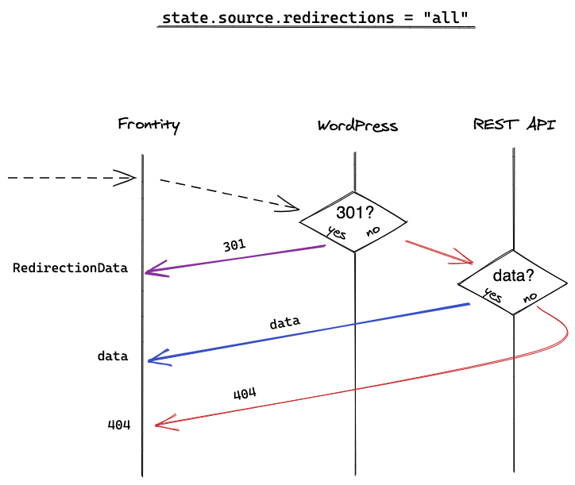
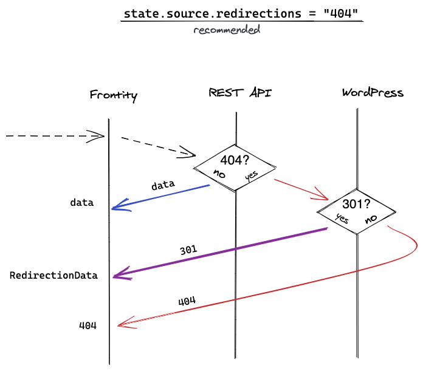
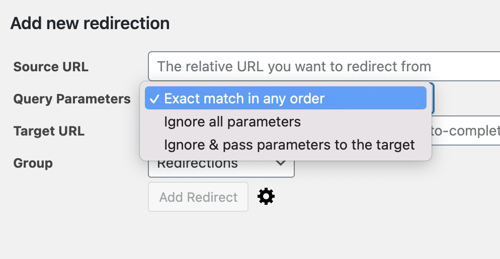
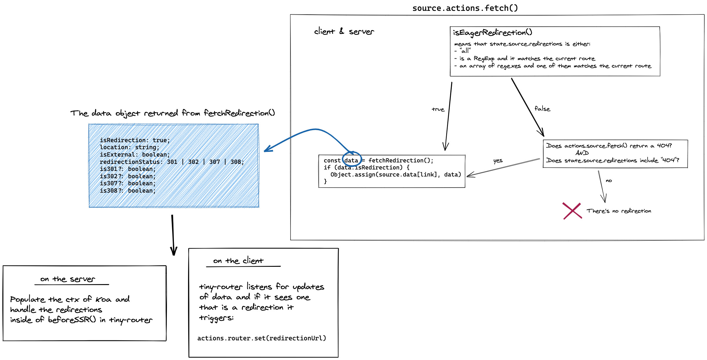

# Redirections with Frontity

Many users store their 30x redirections in the WordPress database, e.g. via a [Redirection plugin](https://wordpress.org/plugins/redirection/). WordPress redirects a user to a new link, for example after a user renames a post and tries to access it using the "old" link. However, no such functionality exists out-of-the-box for the REST API. Since Frontity uses the REST API to retrieve content, it needs a way of handling such redirections.

Have a look at this [Demo](redirections-with-frontity.md#demo) for a bit more in-depth explanation.

## Settings

The redirections functionality works by making an additional request to the WordPress instance to check if a redirection exists for a particular URL. By WordPress instance, we mean the location of your WordPress installation, not the Frontity app. Normally the `state.source.url` points to that location.

The setting [`state.source.redirections`](https://api.frontity.org/frontity-packages/features-packages/wp-source#state-source-redirections) dictates under what circumstances should Frontity make that request to the check if a redirection exists.

The `state.source.redirections` accepts the following values:

#### `"no"`

Does not handle redirections at all. This is the default.

#### `"all"`

Always make an additional request to the WordPress instance to check if there exists a redirection. This means that every time you navigate to a new link, Frontity will make 2 requests: one to the REST API to try to fetch the content and another one to the WordPress instance to check if a redirection exists. Frontity will wait for both requests to finish before proceeding.



#### `"404"`

Only send the additional request to the WordPress instance if the original request to the REST API has returned a 404. This would happen for example if try to access a post that has been renamed.



#### RegEx pattern

A string that contains a regex pattern. The string must start with `RegExp:`. This pattern will be matched against the current route and if matched, Frontity will make an additional request to the WordPress instance to check if there exists a redirection _for that route_. Note that the shorthand character classes will have to be escaped, so for example instead of `\d`, you will need to write `\\d`.

#### Array of strings

An array of strings, which can contain the "404" value as well as any number of strings starting with `"RegExp:"` which represent regular expressions. An additional request will be sent to Wordpress to check for the redirection if any of the regular expressions match the current route. If the array also contains a `"404"`, an additional request will also be made if the original request has returned a 404.

## Usage


In order for the redirections to work correctly you will need to set up CORS headers in your WordPress installation. If you are using the Redirections plugin, [it's quite simple](https://youtu.be/-ekz2JwHHmQ)


In order to use the redirections, there is no need to install any new npm package. There is a new property exposed by the `wp-source` package, [`state.source.redirections`](https://api.frontity.org/frontity-packages/features-packages/wp-source#state-source-redirections) which is used to handle the redirections. The recommended way of using it is by setting it in your `frontity.settings.js` file.

`state.source.redirections` accepts the options outlined above.

**Examples**

```javascript
// frontity.settings.js

{
  name: "@frontity/wp-source",
  state: {
    source: {
      url: "https://test.frontity.org",

      // always check if there exists a redirection.
      redirections: "all",

      // match the url `/some-post` exactly
      redirections: "/some-post/",

      // match urls like `/some-post/1`, `/some-post/2`, etc.
      redirections: "RegExp:/some-post/(\\d*)",

      // match urls like: /some-post/42, /some-otherpost/5
      redirections: "RegExp:/post-(\\w*)/(\\d*)",

      // match a combination of multiple options
      redirections: ["404", "/some-post/", "RegExp:/another-post/(\\d)"],
    },
  },
}
```

### Alternative usage

Redirections work internally by assigning a special `RedirectionData` object to `state.source.data[link]` \(details below in [Technical details](redirections-with-frontity.md##Technical-details)\).

A consequence of that is that [you can alternatively define redirections directly in the `state` or using a custom handler](https://community.frontity.org/t/301-redirects-stored-in-wordpress-database/3032/15).

* Single redirection populating `state.source.data` with `RedirectionData` directly:

  ```text
   const state = {
     source: {
       data: {
         "/old-url/": {
           isReady: true,
           isRedirection: true,
           is301: true,
           redirectionStatus: 301,
           isExternal: false,
           location: "/new-url",
         },
       },
     },
   };
  ```

* A custom handler which assigns properties of `RedirectionData` object for the current route:

  ```text
   const categoryRedirection = {
     pattern: "/category/:slug",
     priority: 5,
     func: ({ link, params }) => {
       state.source.data[link].isReady = true;
       state.source.data[link].isRedirection = true;
       state.source.data[link].is301 = true;
       state.source.data[link].redirectionStatus = 301;
       state.source.data[link].isExternal = false;
       state.source.data[link].location = `/categoria/${params.slug}`;
     },
   };
  ```

## Note on functionalities

* The redirections support not only redirecting to other pages in your WordPress site but also redirecting to external pages. 
* You can define 301, 302, 307 or 308 Redirections.
* We respect the settings of the Redirections plugin with respect to the query parameters:



## Technical details

The redirections are first handled inside of `actions.source.fetch()`. If the setting for `state.source.redirections` contains an ["eager" value](https://github.com/frontity/frontity/blob/2eb98ae4e6fee1f93ac5af5c834a3add644ba7b0/packages/wp-source/src/utils.ts#L152-L186) \(for example if it equals `"all"`\) it is [fetched before calling the handler](https://github.com/frontity/frontity/blob/2eb98ae4e6fee1f93ac5af5c834a3add644ba7b0/packages/wp-source/src/actions.ts#L91-L100) for the current route. "Fetching a redirection" refers to making a request to the WordPress instance to check if a redirection exists for a particular URL.

If a redirection is not "eager" \(for example if `state.source.redirections` is `"404"`\) then we fetch the redirection only [after the request to the REST API has returned a 404](https://github.com/frontity/frontity/blob/2eb98ae4e6fee1f93ac5af5c834a3add644ba7b0/packages/wp-source/src/actions.ts#L152-L160).

The actual logic for fetching the redirection from the WordPress instance is [different on the client and server](https://github.com/frontity/frontity/blob/2eb98ae4e6fee1f93ac5af5c834a3add644ba7b0/packages/wp-source/src/utils.ts#L46-L140) because of platform differences.

In both cases, if a redirection _does_ exist for a a particular route, Frontity populates `state.source.data[link]` with a `RedirectionData` object instead of a "typical" `Data` object like `PostData` or `AuthorData`. This object contains all the information about a redirection that Frontity needs in order to handle it. You can check the [type of `RedirectionData`](https://github.com/frontity/frontity/blob/2eb98ae4e6/packages/source/types/data.ts#L426-L462) to see all of its properties.

Once a `RedirectionData` object is in the state, the behavior of Frontity is different on client and server.

On the **server**, we [check the data object for the current route in the `beforeSSR()` action of `tiny-router`](https://github.com/frontity/frontity/blob/2eb98ae4e6/packages/tiny-router/src/actions.ts#L268-L298). If that object contains a redirection, Frontity will set the correct HTTP status, and redirect using `ctx.redirect(data.location)` where `data.location` contains the final URL .

On the **client**, we [listen to changes to the `state.source.data` object](https://github.com/frontity/frontity/blob/2eb98ae4e6/packages/tiny-router/src/actions.ts#L156-L177) and if the `data` object for current route contains a redirection, Frontity calls `actions.router.set(data.location)` where `data.location` contains the final URL.

The above flow looks something like:



## Demo

This short video demonstrates the usage of the Redirections feature in Frontity.



