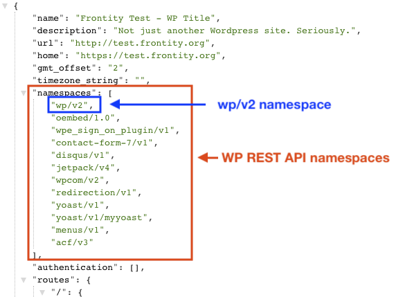

# Which WordPress REST API URL should I use in my Frontity project?

One of the mandatory things we have to first set in a Frontity project is the WordPress REST API that is going to be the source of data of our project. 

This REST API URL is set as part of the `wp-source` package configuration in the `frontity.settings.js`. More specifically, this URL is set as the value of `state.source.api`

```
module.exports = {
  packages: [
    "@frontity/mars-theme",
    "@frontity/tiny-router",
    {
      name: "@frontity/wp-source",
      state: {
        source: {
          api: "https://site.com/wp-json",
        },
      },
    },
  ],
};
```

But... Some Frontity users has asked us. What is the REST API URL of my site?

Well, the format of this URL vary depending on the type of WordPress installation you want to use as a source of data.

In this guide we'll explain the different formats of the REST API URL depending of your WordPress installation. 

But before that, let's first review the concept of [namespaces](https://developer.wordpress.org/rest-api/extending-the-rest-api/routes-and-endpoints/#namespaces) in the REST API

## Namespaces in the REST API

Routes in the WP REST API are grouped under namespaces. They're used to avoid collisions between endpoints and to organize them (core endpoints, plugins endpoints, ...)

There's a namespace reserved for (version `v2`) core endpoints which is:

```jsx
/wp/v2
```

This namespace is used for core endpoints such as:

```jsx
/wp/v2/posts
```

For example If you go to [https://test.frontity.org/wp-json/](https://test.frontity.org/wp-json/)



You can see the `/wp/v2` namespace is available along with some other namespaces, some of them from different plugins:

- `contact-form-7/v1` → Contact Form plugin REST API endpoints
- `yoast/v1` & `yoast/v1/myyoast` → Yoast plugin REST API endpoints
- `acf/v3` → Advanced Custom Fields plugin REST API endpoints
- And others…


You can read more about namespaces, routes and endpoints [here](https://developer.wordpress.org/rest-api/extending-the-rest-api/routes-and-endpoints/#namespaces)


Now that we know what namespaces are about, let's check what is the format of your REST API URL depending on your WordPress installation

## REST API URL depending on WordPress installation

### Do you have a self-hosted WordPress site?

For a **self-hosted WordPress site** (i.e. local or web based) the format of the  REST API URL would be something like:

```
your-wp-domain.com/wp-json
```

From there, you can access the different endpoints available through different namespaces

For example. For the [`https://test.frontity.org`](http://test.frontity.org/) site the URL of the REST API would be [`https://test.frontity.org/wp-json/`](https://test.frontity.org/wp-json/) and from there we can access endpoints such as:

```jsx
test.frontity.org/wp-json/wp/v2/posts
test.frontity.org/wp-json/menus/v1/menus/social-links
```

### Do you have a "Personal plan" (free) wordpress.com site?

With this plan we're not able to install plugins, and because of this we only have access to the core endpoints of the REST API of our site (`/wp/v2/` namespace)

There's a common route for all the  `wordpress.com` sites from where you can access the REST API of your site by adding your site ID after the `/sites` slug
 

```jsx
public-api.wordpress.com/wp/v2/sites/the-slug-of-your-site
```

For example. For the [`https://devrelfrontity.wordpress.com`](http://devrelfrontity.wordpress.com/) site the URL of the REST API would be [`https://public-api.wordpress.com/wp/v2/sites/devrelfrontity.wordpress.com`](https://public-api.wordpress.com/wp/v2/sites/devrelfrontity.wordpress.com) and from there we can access endpoints such as:

```jsx
public-api.wordpress.com/wp/v2/sites/devrelfrontity.wordpress.com/posts
```

As you can see with this format there's now way to access other namespace endopoints rather than those under `/wp/v2`

### Do you have a "Business plan" (paid) wordpress.com site?

To be able to install plugins in a [wordpress.com](http://wordpress.com) site you have to upgrade your plan to a "Business plan"

Once you are in a "Business plan", the first time you install a plugin you'll get an alternative URL of your site (a `.wpcomstaging.com` subdomain)

```jsx
your-wp-domain.wpcomstaging.com
```


Also a redirection will be created from your [wordpress.com](http://wordpress.com) site to this new `wpcomstaging.com` site


This new URL will allow you to directly access the REST API of your site as if it were a self-hosted WordPress installation

```jsx
your-wp-domain.wpcomstaging.com/wp-json
```

So you have access to the endpoints of all the namespaces in your REST API

For example. For the [`https://devrelfrontity.wpcomstaging.com`](https://devrelfrontity.wpcomstaging.com/) site, the URL of the REST API would be [`https://devrelfrontity.wpcomstaging.com/wp-json`](https://devrelfrontity.wpcomstaging.com/wp-json) and from there we can access endpoints such as:

```jsx
https://devrelfrontity.wpcomstaging.com/wp-json/wp/v2/posts
https://devrelfrontity.wpcomstaging.com/wp-json/newspack-blocks/v1/articles
```

## Summary

So, coming back to the initial question: What is the REST API URL of my site? Which URL should I set in the `state.source.api` of my Frontity project?

To answer this question, let's take the `wpsite` ID for a domain/subdomain and let's review the different types of installation your WordPress site may have

- **self-hosted WordPress site**
    - Site url: `wpsite.com`
    - REST API url: `wpsite.com/wp-json`
- **"Personal plan" (free) wordpress.com site**
    - Site url: `wpsite.wordpress.com`
    - REST API url: `public-api.wordpress.com/wp/v2/sites/wpsite.wordpress.com`
- **"Business plan" (paid) wordpress.com site**
    - Site url: `wpsite.wpcomstaging.com`
    - REST API url: `wpsite.wpcomstaging.com/wp-json`

Hope this guide has helped you to understand which REST API URL to set in your Frontity project


Still have questions? Ask [the community](https://community.frontity.org/)! We are here to help 😊

