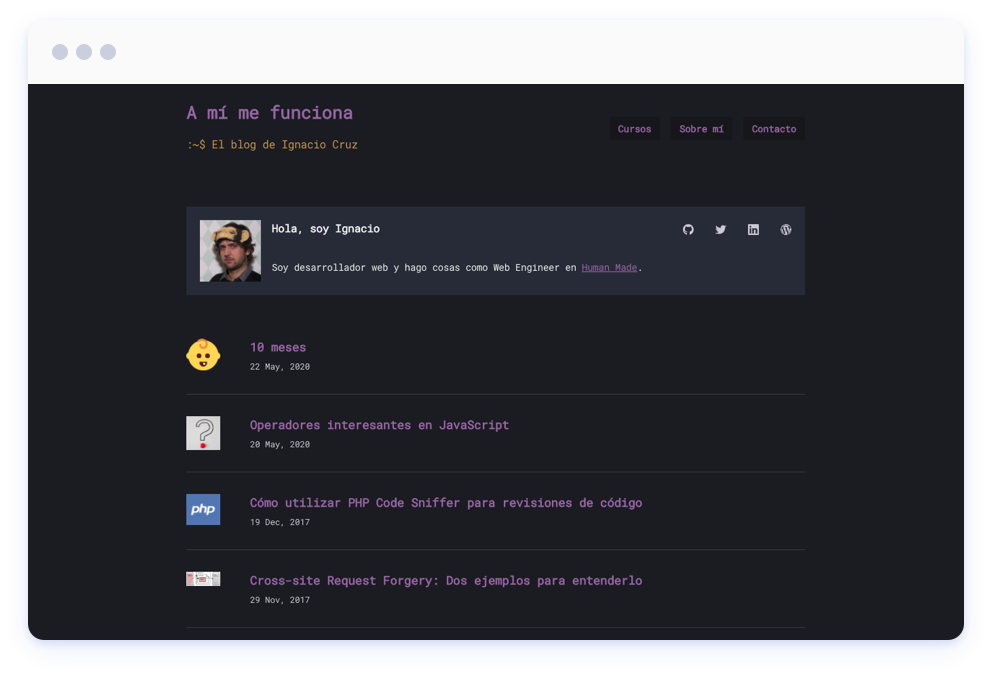

# 🎤 Showcases

Want to see what the community is building with Frontity? Here are some great examples of Frontity in action!


If you have created a Frontity site, whether for a client or as a personal project, you can help us and the rest of the community by [sharing it](https://forms.gle/xThoNSyh6M6rgeM97). Sharing your project will not only allow you to get more visibility and recognition but also help others learn what can be accomplished with Frontity. 🙂


## Frontity

* Site: [https://frontity.org/](https://frontity.org/)
* [Source code](https://github.com/frontity/frontity.org)

> For our new Frontity.org site did a stress test of Frontity + Gutenberg. All layouts were created using built-in blocks. The header and the footer are template parts. For the about page, we reused the same blocks, so no extra code/styles were needed \(and it looks awesome\). [Read more](https://twitter.com/luisherranz/status/1258757519654227968?s=20).

## Frontity Dimension Theme

* Demo: [https://dimension.matnard.now.sh/](https://dimension.matnard.now.sh/)
* [Source code](https://github.com/Matnard/frontity-dimension-theme#readme)

> I applied Frontity on a HTML5 up template and used react-transition-group to orchestrate the animations. It's a simple site but in my opinion it was a great way to get started with Frontity. I might do another one as it was pretty fun to make.[Read more](https://community.frontity.org/t/html5-up-dimension-template-for-frontity-matnard-dimension-theme/2123).

## Ben Wright

* Site: [https://benwrightdev.com/](https://benwrightdev.com/)
* [Source code](https://github.com/ben-wright/ben-frontity)

> Experience with Frontity has been very good, I haven’t had to dive deep into much functionality yet because it’s a very simple site but everything was super easy to get started and the docs are comprehensive. [Read more](https://community.frontity.org/t/personal-portfolio-site/2066).

## Ignacio Cruz

* Site: [https://igmoweb.com/](https://igmoweb.com/)
* [Source code](https://github.com/igmoweb/igmoweb.com)

> I enjoyed a lot working with Frontity, it’s a quite effective piece of software with an easy install and quite simple extensible system. [Read more](https://community.frontity.org/t/my-personal-blog-site/1962).

## I’m Oriol

* Site: [https://www.oriol.im/](https://www.oriol.im/)
* [Source code](https://github.com/oegea/oriol-im)

> Using Frontity has been a pleasure. It’s really awesome how easily you can create a custom theme for Frontity, and integrate all the WordPress data on it. And, as it’s a React app, the possibilities are unlimited, I’m already thinking to add some extra-features with business-logic to my blog. Using WordPress as a headless CMS and having an isolated React App to develop the frontend is the best scenario to achieve that. [Read more](https://community.frontity.org/t/just-migrated-my-personal-blog-to-frontity/1778).

## Aslan French

* Site: [https://aslanfrench.work/](https://aslanfrench.work/)
* [Source code](https://github.com/jcklpe/desert-jackalope)

> It’s essentially built off the mars-theme, with my own custom styling added and some of the structure rearranged. I’m still new to React and I’m primarily a designer \(though I call myself a “design technologist” to hint at that\), but I think there’s some nice stuff about it. [Read more](https://community.frontity.org/t/frontity-blog-portfolio-theme-desert-jackalope/1504).

## Frontend Scrapbook

* Site: [https://codeinjavascript.com](https://codeinjavascript.com)
* [Source code](https://github.com/vimalkodoth/frontity)

> Frontity is really exciting! I was looking around for a scalable solution for a WordPress based news portal project. Doing some search on Google took me to the Frontity website. I started exploring the architecture and found it something similar to what I had in my mind, having separation of concerns - frontend and backend api. Having myself working as a developer and having experience with React, I really liked the idea and decided to give it a try. As the news portal project was moved to later this year, I thought to build a personal blog on tech to learn about the framework. With some help from the community, I could successfully setup to run Frontity as a microservice on AWS and running the backend cms on another EC2 instance. I even configured backend to work with AWS Opsworks, there by able to horizontally scale the same time. It was easy to setup and had to tweak just the frontity templates for the frontend. I'm still to explore whole range of possibilities Frontity provides for my upcoming news portal project.

## Frontity Starter Theme

* Demo: [https://frontity-starter-theme.alexadark.now.sh/](https://frontity-starter-theme.alexadark.now.sh/)
* [Source code](https://github.com/alexadark/frontity-starter-theme)

> The goal of this work was first to learn Frontity building something real, and also build a tool for myself and the community, simple enough to let creativity open, allowing to build something totally different on top of it. [Read more](https://community.frontity.org/t/frontity-starter-theme/1473).

## 403page.com

* Site: [https://403page.com/](https://403page.com/)
* [Source code](https://github.com/403pagelabs/fourothree-theme)

> My first Frontity project \(though plenty of Frankensteining different components from Mars and TwentyTwenty\). Just wanted to share it here though it's in a very early version - just super pumped to have a somewhat workable version. [Read more](https://community.frontity.org/t/first-frontity-jobby/1102).

## Diariomotor Competición

* Site: [https://www.diariomotor.com/competicion/](https://www.diariomotor.com/competicion/)

## Színház Online

* Site: [https://szinhaz.online/](https://szinhaz.online/)

## Frontity Chakra Theme

* Demo: [https://frontity-chakra.now.sh/](https://frontity-chakra.now.sh/)
* [Source code](https://github.com/chakra-ui/frontity-chakra-ui-theme)

> I had fun building this theme for Frontity using Chakra UI. It’s really interesting to see how headless Wordpress, Frontity and Component libraries can work together to create a great experience for a website or blog. [Read more](https://twitter.com/thesegunadebayo/status/1222236405780426754?s=20).

## FORT

* Site: [https://fortstudio.com/](https://fortstudio.com/)

> It’s kind of crazy how quickly I was able to do this knowing nothing about Frontity and not being super advanced with React. It was a 2.5 week dev timeline, and the mouse elements in particular were challenging to do, not due to Frontity but mostly due to lack of familiarity with doing advanced React stuff. [Read more](https://community.frontity.org/t/i-redid-my-companys-website-in-frontity-here-it-is/1037).

## Goiblas

* Site: [https://goiblas.com/](https://goiblas.com/)
* [Source code](https://github.com/goiblas/personal-blog)

> I’ve been this weekend creating a Frontity theme with the api rest of wordpress.com and the feeling is fantastic. [Read more](https://community.frontity.org/t/personal-blog/360).

## SupportLogic

* Site: [https://www.supportlogic.io/](https://www.supportlogic.io/)

## CrowdFarming

* Site: [https://www.crowdfarming.com/es/blog](https://www.crowdfarming.com/es/blog)

## Tus Juegos IO

* Site: [http://tusjuegos.io/](http://tusjuegos.io/)

> It’s not my best site, but I’m proud that I made it in one day. I think you can build almost everything with Frontity. So this is an example that shows the power of mixing WordPress + React. [Read more](https://community.frontity.org/t/frontity-is-more-than-just-blogs/1165).

## Shaun Guimond

* Site: [https://shaunguimond.com/](https://shaunguimond.com/)
* [Source code](https://github.com/Tikio88/Shaun-Guimond)

> I just wanted to share the test blog I created with the Twenty Nineteen theme for Frontity. I feel like this is an amazing platform and I hope to learn as much as I can to create my own custom theme for Frontity. [Read more](https://community.frontity.org/t/new-coder-learning-twenty-nineteen-theme/484).

## Primitive Digital

* Site: [https://primitivedigital.co.uk/](https://primitivedigital.co.uk/)
* [Source code](https://github.com/primitiveshaun/primitiveone)

> I must admit I’m impressed with Frontity, I’ve hit hardly any errors, which for a brand new framework is quite an achievement. [Read more](https://community.frontity.org/t/some-frontity-based-monkey-business/655).

## Twenty Nineteen Frontity Theme

* Demo: [https://twentynineteen.frontity.org/](https://twentynineteen.frontity.org/)
* [Source code](https://github.com/imranhsayed/frontity-twentynineteen)

> We used Mars as a starter theme which gave us a kickstart. It made it very simple for us to customize the theme. We also added pagination. [Read more](https://community.frontity.org/t/twenty-nineteen-wordpress-theme-for-frontity/438).

## [Add your Frontity site](https://forms.gle/xThoNSyh6M6rgeM97)

