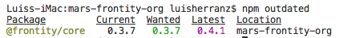

# Keep Frontity updated

As in most projects, keeping Frontity and its packages updated is always a good practice. Not only you could use new features added, but also some security issues are usually detected and solved during these updates. 

With Frontity, just one command is needed to update all your packages at once, although you can also update just one package.

* [Check outdated packages](keep-frontity-updated.md#check-outdated-packages)
* [Update the whole project](keep-frontity-updated.md#update-the-whole-project)
* [Update just one package](keep-frontity-updated.md#update-just-one-package)

### Check outdated packages

At Frontity CLI, you can check if your packages are outdated with a single command:

```text
npm outdated
```

This command will generate a list of all your packages out of date:



### Update the whole project

You can update your project and all the packages running this command:

```text
npm update
```

This command will update the `package.json` with the latest compatible versions.


### Update just one package

Although it is recommended to keep all your packages updated, you can update just one if you need it by running this command:

```text
npm update my-package
```


Note that **this command is not included in current Beta**, it will be released for the 1.0.0. At this moment, you can do it with:

`npm install my-package@latest`

Be careful, as this can include breaking changes and broke your code if it’s not properly updated. **That won’t happen once we release the `1.0.0` version.**




Still any doubts? Ask [the community](https://community.frontity.org/)! We are here to help 😊


